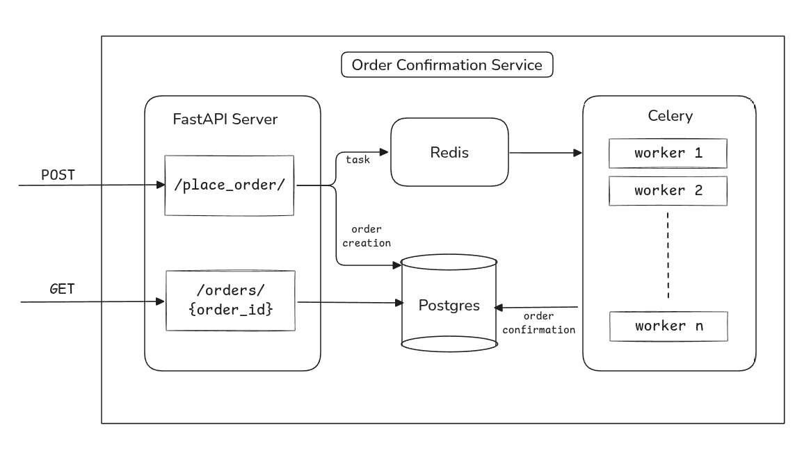

# Order Confirmation

This mini project simulates the process of placing and confirming an order on an ecommerce app.

## Stack

* FastAPI for endpoints
* Postgres with SQLAlchemy for ORM
* Celery for async workers
* Redis as Message Broker

## Flow

* Client posts an order to the endpoint.
* Order is created with `PENDING` status
* Celery task is called with the Order ID - it simulates order confirmation (sleeps 10 seconds)
* Order status is set to confirmed

## What I've learned

1. Setting up and managing ORM Sessions in a concurrent setup
2. Setting up Celery & Celery workers
3. Redis as Message broker

## Architecture

